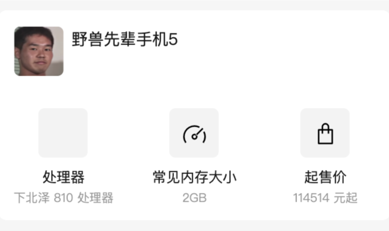

# 概览卡片



概览卡片是 Codename Xview 小程序中产品信息页中的一个组件，用于显示所介绍的产品的一些常见信息，便于用户了解该产品，如图所示。基于 T-Design 组件库的菜单项和宫格组件二次封装。

## 说明

使用例：

```html
<x-ihead
  x_pd_name="{{seriesinfo.pd_series_title}}"
  x_slogan="{{seriesinfo.pd_series_desc}}"
  x_iconlist="{{seriesinfo.icon_list}}"
  x_pd_img="{{seriesinfo.pd_series_pic}}"
/>
```

需要传入的参数分别是：标题、副标题（口号）、宫格列表、图片。前两个为字符串，第三个为数组（下面会说明）、最后一个为 URL。
宫格部分的渲染是根据后端的 `/api/model-query/detail/${now_id}` 接口的 `icon_list` 数组进行渲染的，样例如下所示：

```json
"icon_list": [
    {
        "icon": "layers",
        "grid_title": "处理器",
        "grid_desc": "下北泽 810 处理器"
    },
    {
        "icon": "dashboard",
        "grid_title": "常见内存大小",
        "grid_desc": "2GB"
    },
    {
        "icon": "shop",
        "grid_title": "起售价",
        "grid_desc": "1 元起"
    },
]
```

其中，`icon` 是宫格的图标，`grid_title` 和 `grid_desc` 分别是宫格项目的标题和描述。这个需要在数据库里进行填写。

icon 的值不能为任意，icon 的值应当为 T-Design 组件库中的所列出的图标的值，如果设置为列出以外的值，那么图标内容可能会无法正常显示，关于组件库图标的值请参阅：[TDesign (tencent.com)](https://tdesign.tencent.com/miniprogram/components/icon)

一般情况下，宫格中会有 3 个项目，当然也可以增加为 4 个，5 个甚至更多，但由于宫格已经设定为 3 的倍数，因为 4、5 个可能显示效果不会好看，建议设置为 3 的倍数。
